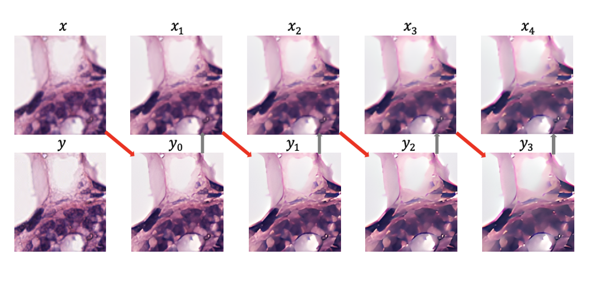
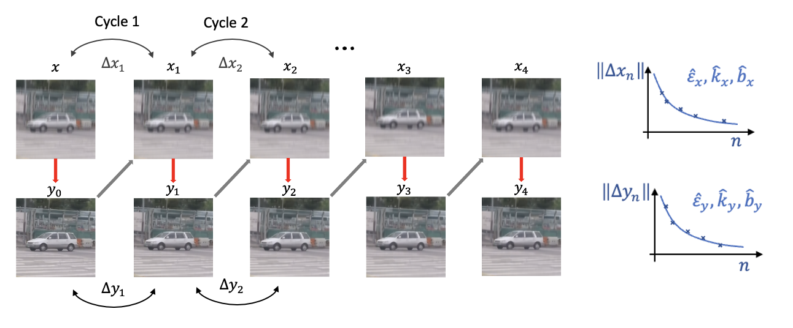
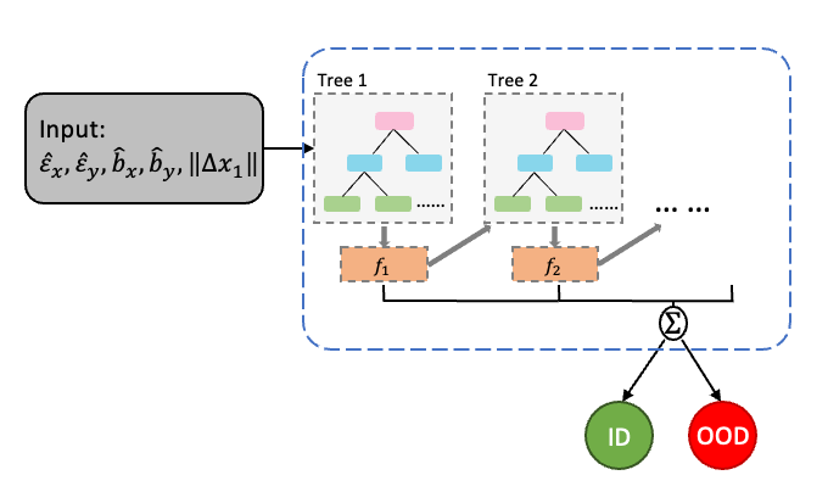

# Cycle Consistency-based Uncertainty Quantification of Neural Networks in Inverse Imaging Problems

This repository contains the code for implementing the cycle inference process and detecting out-of-distribution data using our Cycle Consistency-based Uncertainty Quantification method. For more details, refer to our [paper](https://arxiv.org/abs/2305.12852).



**Paper:** [Cycle Consistency-based Uncertainty Quantification of Neural Networks in Inverse Imaging Problems](https://arxiv.org/abs/2305.12852)

- [Luzhe Huang](https://arxiv.org/search/cs?searchtype=author&query=Huang%2C+L)
- [Jianing Li](https://arxiv.org/search/cs?searchtype=author&query=Li%2C+J)
- [Xiaofu Ding](https://arxiv.org/search/cs?searchtype=author&query=Ding%2C+X)
- [Yijie Zhang](https://arxiv.org/search/cs?searchtype=author&query=Zhang%2C+Y)
- [Hanlong Chen](https://arxiv.org/search/cs?searchtype=author&query=Chen%2C+H)
- [Aydogan Ozcan](https://arxiv.org/search/cs?searchtype=author&query=Ozcan%2C+A)

> UCLA
>
> Submitted to Nature Computational Science

<br>
Uncertainty estimation is critical for numerous real-world applications of deep neural networks and draws growing attention from researchers.



Our method employs a unique approach to quantify uncertainty in deep neural networks for inverse problems, using cycle consistency. We construct forward-backward cycles with the physical forward model and the trained neural network, subsequently developing uncertainty estimators via regression analysis of these cycles. This technique offers insights into the relationship between the neural network's uncertainty, inference bias, and robustness. It excels in classifying corrupted and out-of-distribution data, demonstrating its effectiveness with popular image deblurring and super-resolution neural networks.

### Getting Started

First, download our repo:

```bash
git clone https://github.com/Jackyy-Li/Cycle-Consistency-based-Uncertainty-Estimator.git
cd Cycle-Consistency-based-Uncertainty-Estimator
```

For an express instillation, we include ``requirements.txt`` file.

Run the following command to install all the dependencies needed:

```bash
pip install -r requirements.txt
```

## Out-of-Distribution Detection Experiment 

The out-of-distribution detection task uses average pooling algorithm as physical forward model and REAL-ESRGAN network as trained neural work. 

The following guidance shows the process for the out-of-distribution experiment:

```bash
cd ESRGAN_CCUQ
```

### Implement Cycle Inference Process

Use inference_cycle.py to implement cycle inference process. 

The following command will execute cycle inference process for cycle number=5 on 'input' directory and save the output image and .mat file needed to derive uncertainty estimators in 'output' directory :

```bash
python inference_cycle.py -i ".\input\demo" -o ".\output\demo" -cn 5
```

We used cycle number = 20 as the default number. Quicker results can be obtained through using a lesser cycle number.
### Derive Uncertainty Estimators

The following command will then use uncertainty_quant_alt.py to derive the uncertainty estimators:

```bash
python uncertainty_quant_alt.py
```

### Use XGBoost Classifier with uncertainty estimators

"OOD_detection.ipynb" contains the code to perform out-of-distribution detection on the result. The presentation shows the RMSE heatmap for the supervised ResNet-50 baseline model result. Please change the code (directory of your result paths)accordingly to generate your own result.




## Corrupted Input Detection Experiment 

The corrupted input detection experiment uses motion blur kernel as physical forward model and DeepRFT model as trained neural network. 

### Generate Blurred data 


### Implement Cycle Inference Process

Use inference_cycle.py to implement cycle inference process. 

The following command will execute cycle inference process for cycle number=5 on 'input' directory and save the output image and .mat file needed to derive uncertainty estimators in 'output' directory :

```bash
python inference_cycle.py -i ".\input\demo" -o ".\output\demo" -cn 5
```

### Derive Uncertainty Estimators 

The following command will then use uncertainty_quant_alt.py to derive the uncertainty estimators:

```bash
python uncertainty_quant_alt.py
```

### Use XGBoost Classifier with uncertainty estimators 


## Acknowledgements


## Related Work

1. Nguyen, G. et al. Machine Learning and Deep Learning frameworks and libraries for largescale data mining: a survey. Artif. Intell. Rev. 52, 77–124 (2019).
2. Otter, D. W., Medina, J. R. & Kalita, J. K. A Survey of the Usages of Deep Learning for Natural
   Language Processing. IEEE Trans. Neural Netw. Learn. Syst. 32, 604–624 (2021).
3. Voulodimos, A., Doulamis, N., Doulamis, A. & Protopapadakis, E. Deep Learning for
   Computer Vision: A Brief Review. Comput. Intell. Neurosci. 2018, 1–13 (2018).
4. Grigorescu, S., Trasnea, B., Cocias, T. & Macesanu, G. A survey of deep learning techniques
   for autonomous driving. J. Field Robot. 37, 362–386 (2020).
5. Barbastathis, G., Ozcan, A. & Situ, G. On the use of deep learning for computational
   imaging. Optica 6, 921–943 (2019).
6. Rivenson, Y. et al. Virtual histological staining of unlabelled tissue-autofluorescence images
   via deep learning. Nat. Biomed. Eng. 3, 466–477 (2019).
7. Yang, J., Zhou, K., Li, Y. & Liu, Z. Generalized Out-of-Distribution Detection: A Survey.
   Preprint at http://arxiv.org/abs/2110.11334 (2022).

# Reference

If you find our code useful for your research, please cite our paper.

```
Huang, L., Li, J., Ding, X., Zhang, Y., Chen, H., & Ozcan, A. (2023).
Cycle Consistency-based Uncertainty Quantification of Neural Networks in Inverse Imaging Problems. arXiv preprint.
arXiv:2305.12852. Retrieved from https://doi.org/10.48550/arXiv.2305.12852
```
